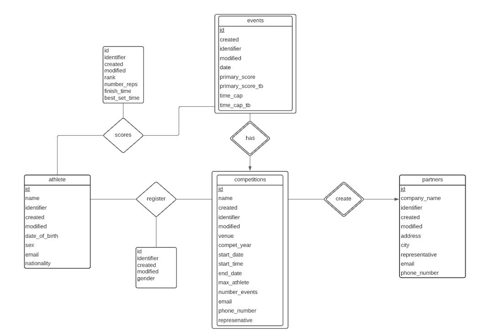
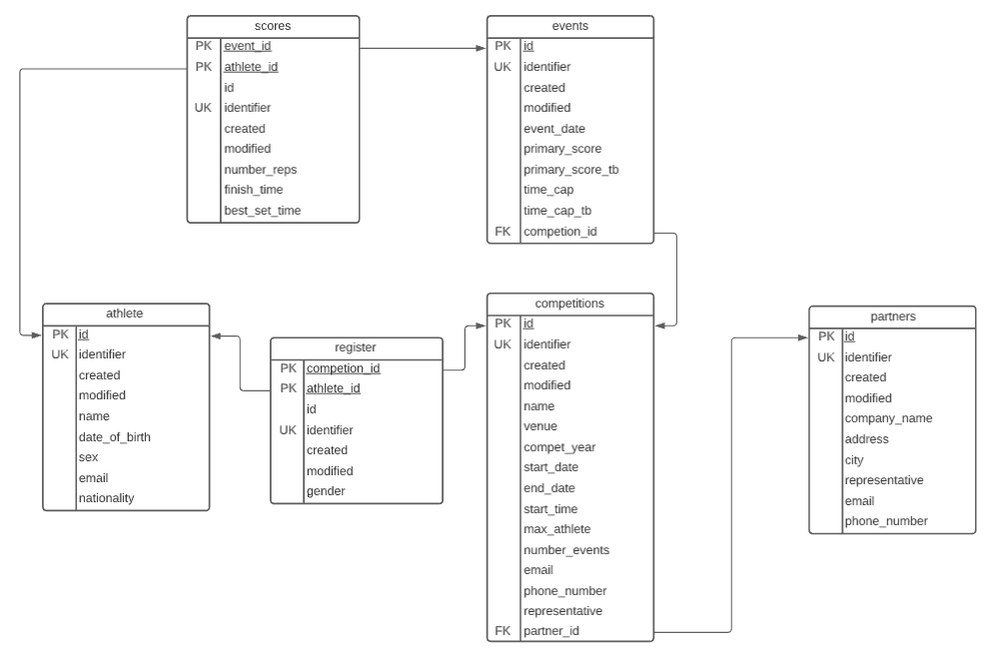
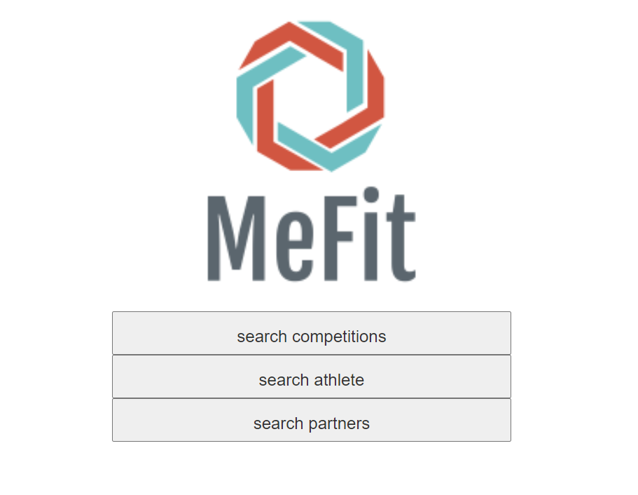
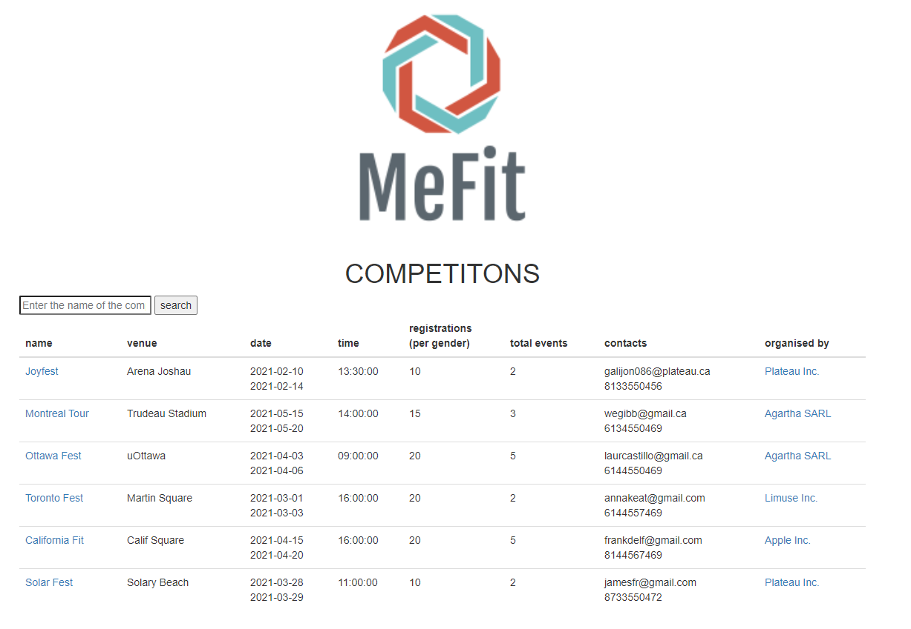
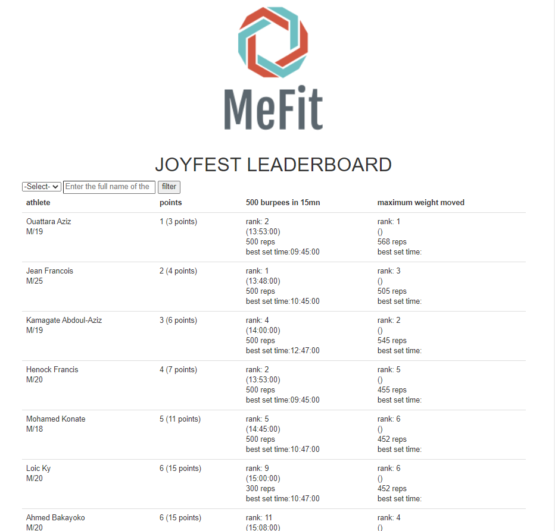
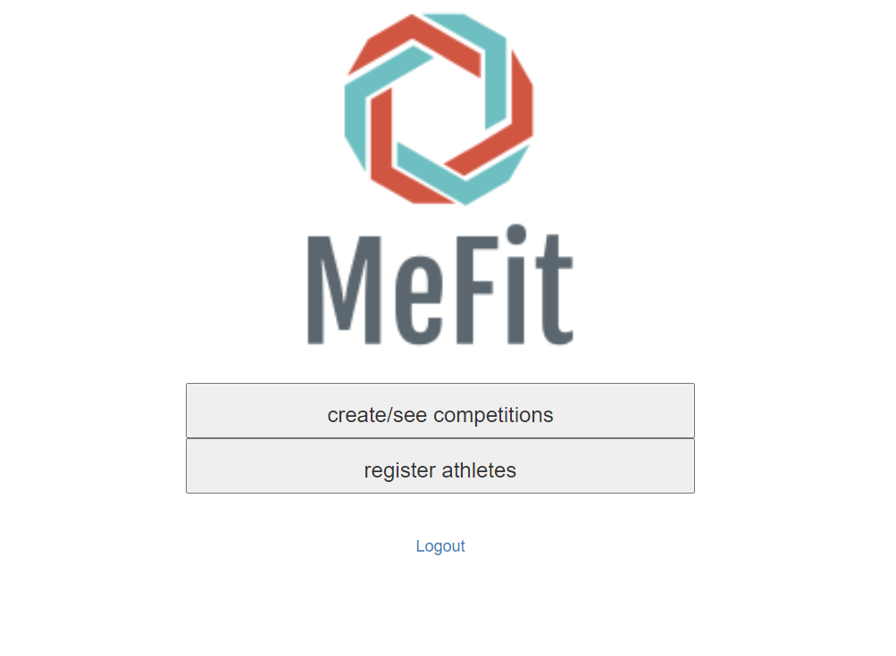
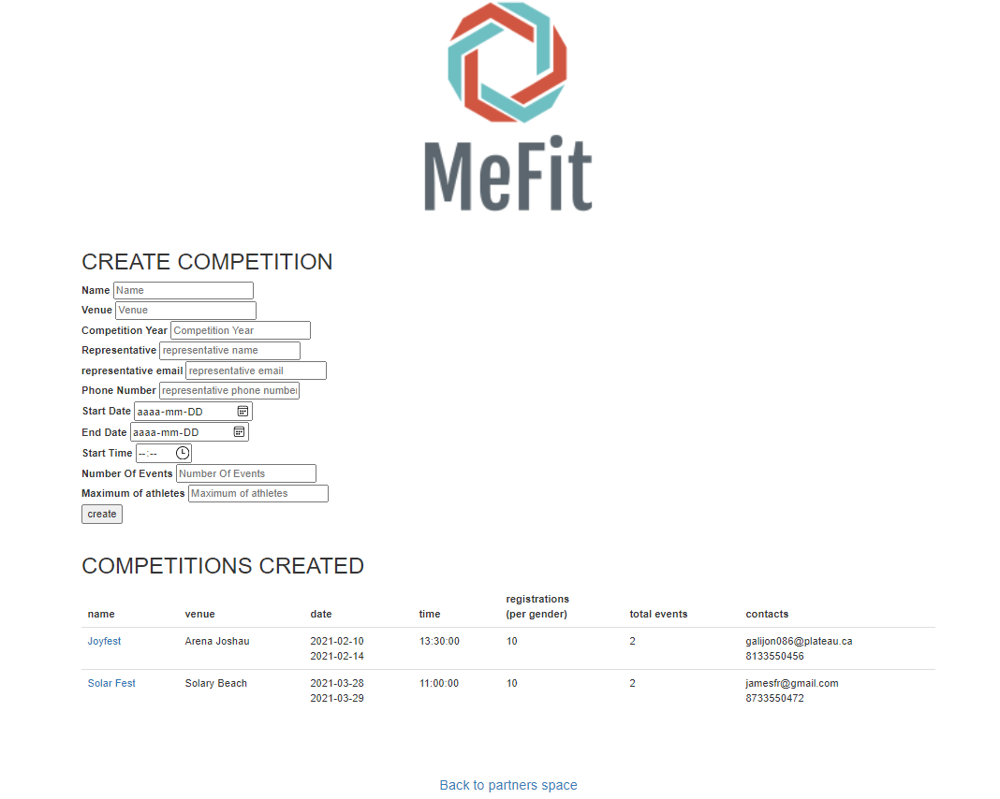
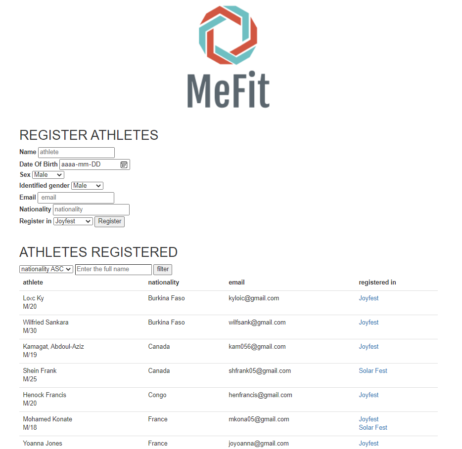
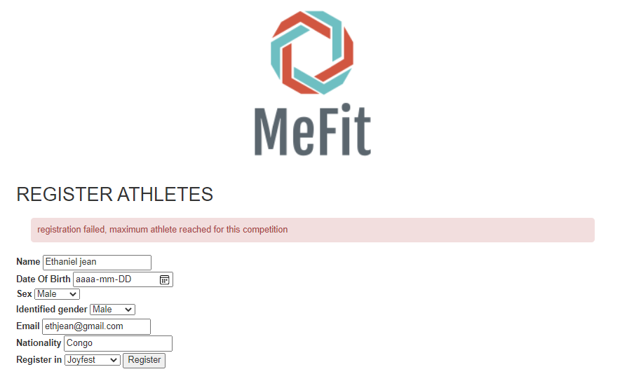
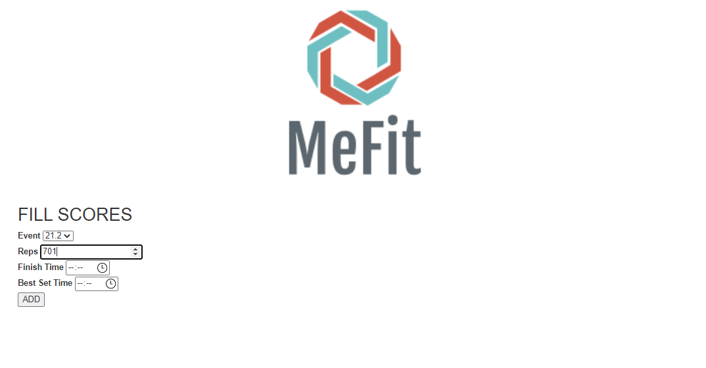

# Projet Universitaire CSI2532


| Nom              | Numéro d'étudiant | Email               |
| ---------------- | ----------------- | ------------------- |
| Mohamed Konate   | 300136750         | mkona055@uottawa.ca |
| Wilfried Sankara | 300100940         | wsank045@uottawa.ca |

## Livrables précédents

- [Livrable1](livrable1.md)
- [Livrable2](livrable2.md)
- [Livrable3](livrable3.md)

## Livrable 4


| Mark | Description                                         | Comment                                                      |
| ---- | --------------------------------------------------- | ------------------------------------------------------------ |
| 3.0  | Diapositives                                        | Voir le fichier [presentation](Presentation.pdf)             |
| 3.0  | Application                                         | Voir ci-dessous                                              |
| 2.0  | SQL "seed"                                          | Voir le "[seed](db/seed.sql)"                                |
| 1.0  | Modèle ER / Modèle relationnel (et schéma SQL)      | Voir ci-dessous le modèle ER/relationnel. Voir le [schema](db/schema.sql) |
| 1.0  | README.md contient toutes les informations requises | Voir cette page                                              |
| / 10 |                                                     |                                                              |

### Description de l'application

Voir [livrable3](livrable3.md)

### Diagram ER 

Ce diagramme a été réalisé avec [LucidChart](https://lucid.app/)




### Modèle Relationel 

Ce diagramme  a été réalisé aussi avec [LucidChart](https://lucid.app/)




### Schéma SQL  

[Cliquez ici pour consulter le fichier](db/schema.sql)

### Seed SQL
[Cliquez ici pour consulter le fichier](db/seed.sql)


### Application

Notre application utilises PHP. Veillez à ce que votre environnement de travail soit adapté à la connexion à partir d'une base de données PostgreSQL. 

Créer une base de données PostgreSQL à partir du Command Line(CMD) s'assurer que le CMD pour chemin celui du *repository* duquel ce fichier README.md est extrait

```shell
psql -c "CREATE DATABASE leaderboard "
```

Ajouter le schéma et le *seed* à notre base de données

``` shell
psql -d leaderboard -f db/schema.sql -f db/seed.sql
```

Ouvrez le fichier [config.php](public/config.php) puis rajouter vos identifiants de connexion PostgreSQL à la ligne 2

*Si votre port par défaut n'est pas pas égal à 5432 le modifier en conséquence.*

```php
$db = pg_connect("host = localhost port=5432 dbname=leaderboard user=your_username password=your_password");
```

Ensuite, lancez le cmd à partir du dossier public qui est contenu également dans ce livrable. et entrez la commande ci dessous

```shell
php -S localhost:4000
```

Puis ouvrez une page web et entrer en tant que URL ***localhost:4000*** 

### Pages Web pour utilisateurs

Vous devrez voir ceci :



Cette page est destinée aux utilisateurs communs tous le monde peut y avoir accès. Les utilisateurs peuvent rechercher des compétitions et des partenaires .



Afin d'avoir accès au leaderboard un clic sur le nom de la compétitions devrait faire l'affaire. Ici on clic sur JoyFest





Vous avez des pages web similaires pour les partenaires et les athlètes.


### API et application pour les partenaires

Les partenaires doivent avoir leur propre jeton et on le vérifie de la sorte :

```bash
yourpathto\public>curl -i -H "partner-api-key:d40db17785bfc3057d2995bd7aab1514" http://localhost:4000/api.php
HTTP/1.1 200 OK
Host: localhost:4000
Date: Wed, 31 Mar 2021 05:05:06 GMT
Connection: close
X-Powered-By: PHP/8.0.2
Content-Type: application/json
URL_TO_COPY:http://localhost:4000/partners_space.php?identifier=d40db17785bfc3057d2995bd7aab1514

{"Success":"Connected Successfully. Copy and paste the above URL into your browser "}
```

ici le jeton généré automatiquement pour le partenaire Plateau Inc. est d40db17785bfc3057d2995bd7aab1514

Afin de trouver le jeton correspondant dans votre base de données en tant qu'administrateur MeFit vous pouvez faire:

```sql
SELECT identifier from partners WHERE comapany_name = 'Plateau Inc.';
```

Si le jeton est incorrect on aura ceci:

```bash
yourpathto\public>curl -i -H "partner-api-key:itsnotgoingtowork55555" http://localhost:4000/api.php
HTTP/1.1 401 Unauthorized
Host: localhost:4000
Date: Wed, 31 Mar 2021 06:27:04 GMT
Connection: close
X-Powered-By: PHP/8.0.2
Content-Type: application/json

{"Authentication error":"Please provide a valid secret-key"}
```

 Dans le cas ou le jeton est correct le partenaire a accès a un UI qui lui est propre grâce a une URL qui lui est fournie comme vous pouvez le voir ci haut.

En copiant cette URL on obtient ceci:



Ici le partenaire peut créer des compétitions:



Ou inscrire des athlètes  :




si le nombre maximum est atteint vous aurez un message d'erreur vous le mentionnant ici on inscrit un nouvel athlete masculin a Joyfest qui a déja 10 athletes masculins(max):




En cliquant sur les compétitions qui sont dans la colonne "registered in"  le partenaire peut entrer les scores correspondant à l'évènement choisi.

Ici on clique sur JoyFest pour 'Mohamed Konate' on update à 701reps pour l'évenement "20.2"



Seuls les administrateurs MeFit peuvent supprimer des partenaires et athlètes. Si les partenaires veulent  annuler une inscription a une compétition ils devront contacter MeFit.

