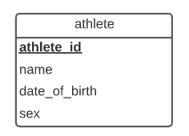

# Projet Universitaire CSI2532


| Nom             | Numéro d'étudiant | Email               |
| --------------  | ----------------- | ------------------- |
| Mohamed Konate  | 300136750         | mkona055@uottawa.ca |
| Wilfried Sankara| 300100940         | wsank045@uottawa.ca |

## Livrable 1


### Diagram ER 

- *Inclure votre modèle ER (sous forme d'image et de liens vers tous les fichiers source)*
- *Instructions sur la façon dont vous avez créé votre modèle ER*

Ce diagramme a été réalisé avec [LucidChart](https://lucid.app/)




### Modèle Relationel 

- *Inclure votre modèle relationnel (sous forme d'image et de liens vers des fichiers source)*
- *Instructions sur la façon dont vous avez créé  modèle relationnel*

Ce diagramme est identique au précédent et a été réalisé aussi avec [LucidChart](https://lucid.app/)


### Schema SQL

- *Une référence à votre schéma SQL (et comment l'exécuter)*

La base de donnée a été créée en utilisant pgAdmin4 

``` sql
CREATE DATABASE mkona055
    WITH 
    OWNER = mkona055
    ENCODING = 'UTF8'
    LC_COLLATE = 'C'
    LC_CTYPE = 'C'
    TABLESPACE = pg_default
    CONNECTION LIMIT = -1;
```

Le code SQL suivant permettra de créer le schéma correspondant à cette partie du projet

``` sql
CREATE TABLE athlete (
athlete_id int,
name varchar(300),
date_of_birth date,
sex varchar(2),
PRIMARY KEY (athlete_id) 
);
```


### Exemples de SQL

- *Exemples de requêtes pour afficher INSERT, UPDATE, SELECT, DELETE sur votre base de données*

#### INSERT

``` sql
INSERT INTO athlete (athlete_id, name, date_of_birth, sex)
VALUES(1,'Mohamed Konate','2002/05/01','M'),
(2,'Kamagaté Abdoul-Aziz','2001/10/16','M'),
(3,'Loïc Ky','2000/09/14','M'),
(4, 'Molly Kanyatsi','2001/09/16','F'),
(5, 'Yoanna Jones', '2001/02/09','F');
```

Output:

| athlete_id | name                 | date_of_birth | sex  |
| :--------: | :------------------- | ------------- | :--: |
|     1      | Mohamed Konate       | 2002/05/01    |  M   |
|     2      | Kamagaté Abdoul-Aziz | 2001/10/16    |  M   |
|     3      | Loïc Ky              | 2000/09/14    |  M   |
|     4      | Molly Kanyatsi       | 2001/09/16    |  F   |
|     5      | Yoanna Jones         | 2001/02/09    |  F   |


#### UPDATE

``` sql
UPDATE athlete
	SET name = 'Mohamed Soma Konate'
	WHERE name = 'Mohamed Konate';
```

Output:

| athlete_id | name                 | date_of_birth | sex  |
| :--------: | :------------------- | ------------- | :--: |
|     1      | Mohamed Soma Konate  | 2002/05/01    |  M   |
|     2      | Kamagaté Abdoul-Aziz | 2001/10/16    |  M   |
|     3      | Loïc Ky              | 2000/09/14    |  M   |
|     4      | Molly Kanyatsi       | 2001/09/16    |  F   |
|     5      | Yoanna Jones         | 2001/02/09    |  F   |


#### SELECT

``` sql
SELECT athlete_id, name, date_of_birth, sex
FROM athlete
WHERE sex = 'M'
ORDER BY date_of_birth ASC
```

Output:

| athlete_id | name                 | date_of_birth | sex  |
| :--------: | :------------------- | ------------- | :--: |
|     3      | Loïc Ky              | 2000/09/14    |  M   |
|     2      | Kamagaté Abdoul-Aziz | 2001/10/16    |  M   |
|     1      | Mohamed Soma Konate  | 2002/05/01    |  M   |

#### DELETE

``` sql
DELETE FROM athlete 
WHERE date_of_birth = '2000/09/14'
```

Output:

| athlete_id | name                 | date_of_birth | sex  |
| :--------: | :------------------- | ------------- | :--: |
|     2      | Kamagaté Abdoul-Aziz | 2001/10/16    |  M   |
|     4      | Molly Kanyatsi       | 2001/09/16    |  F   |
|     5      | Yoanna Jones         | 2001/02/09    |  F   |
|     1      | Mohamed Soma Konate  | 2002/05/01    |  M   |
