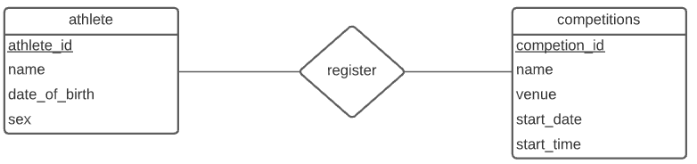
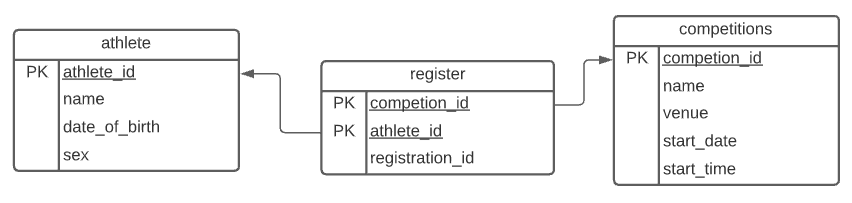
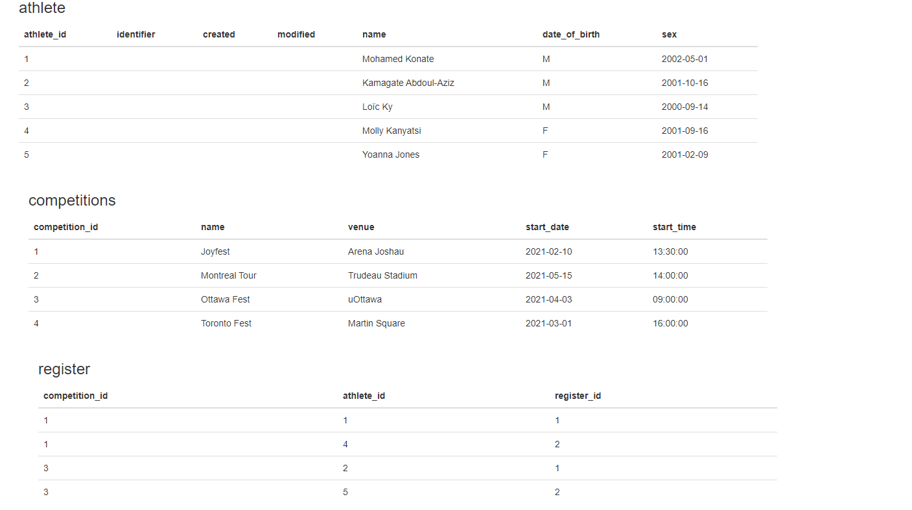

# Projet Universitaire CSI2532


| Nom              | Numéro d'étudiant | Email               |
| ---------------- | ----------------- | ------------------- |
| Mohamed Konate   | 300136750         | mkona055@uottawa.ca |
| Wilfried Sankara | 300100940         | wsank045@uottawa.ca |

## Livrables précédents

- [Livrable1](livrable1.md)


## Livrable 2


| Mark | Description                                                  | Comment                                                      |
| ---- | ------------------------------------------------------------ | ------------------------------------------------------------ |
| 3.0  | Modèle ER                                                    | Voir ci-dessous                                              |
| 3.0  | Modèle relationnel / schéma SQL                              | Voir ci-dessous le modele relationnel,Voir le [schema](db/schema.sql) |
| 1.0  | Application (READ-ONLY)                                      |                                                              |
| 1.0  | SQL "seed" /SQL examples to INSERT, UPDATE, SELECT and DELETE data | Voir le "[seed](db/seed.sql)" et voir  ci-dessous les exemples |
| 1.0  | README.md contient toutes les informations requises          | Voir cette page                                              |
| 1.0  | Utilisation de git (messages de commit, tous les étudiants impliqués) | Voir [les details des commits dans GitHub](https://github.com/professor-forward/projet-team-awesome/commits/main) |
| / 10 |                                                              |                                                              |


* Mettez à jour votre modèle ER / modèles relationnels à partir du Livrable 1 mais inclure les `competitions`. Une compétition a un  `name`, `venue`, une date (par exemple `start_date`, `start_time` ou peut-être `start_date_time`). Compétitions s’exécutent généralement sur plusieurs jours (elles doivent donc pister la "durée" `duration`)
* Un `athlete` peut s'inscrire ( `register` ) à n'importe quelle compétition. 

### Diagram ER 
Ce diagramme a été réalisé avec [LucidChart](https://lucid.app/)




### Modèle Relationel 

Ce diagramme  a été réalisé aussi avec [LucidChart](https://lucid.app/)



### Schéma SQL

- Modifiez votre schéma de Livrable 1 pour qu'il s'agisse d'une migration. Maintenant, au lieu de modifier votre schéma directement, créez une script de migration pour évoluer votre base de données dans le modèle de Livrable 2.
- Garder la copie la plus récente de votre schéma, qui doit s'aligner avec le modèle ER et modèle relationnel.
  Notez que l'application de toutes les migrations SQL doit être équivalente à ce schéma la plus récente.
  Documentez comment exécuter vos migrations.

#### Script de  Migration

Ces migrations ont été exécutées avec pgAdmin4 à l'aide duquel nous avons créer notre premier schéma

#####  **[202102071416-create-competitions](db/migrations/202102071416-create-competitions.sql)**

``` sql
CREATE TABLE competitions(
  competition_id int,
  name varchar(100),
  venue varchar (100),
  start_date date,
  start_time time,
  PRIMARY KEY(competition_id)
);
```

#####  **[202102071416-create-register](db/migrations/202102071416-create-register.sql)**

``` sql
CREATE TABLE register(
  competition_id int,
  athlete_id int,
  register_id int,
  PRIMARY KEY(competition_id,athlete_id),
  FOREIGN KEY(competition_id) references competitions(competition_id)
  	ON DELETE CASCADE    
  	ON UPDATE CASCADE,
  FOREIGN KEY(athlete_id) references athlete(athlete_id)
	ON DELETE CASCADE    
  	ON UPDATE CASCADE
);
```

##### **[add-attributes-to-athlete](db/migrations/202102081729-add-attributes-to-athlete)**

```sql
ALTER TABLE athlete
ADD identifier varchar(50),
ADD created timestamp,
ADD modified timestamp;
```

##### **[update-athlete-name-column](db/migrations/202102081744-update-athlete-name-column)**

```sql
ALTER TABLE athlete
ALTER COLUMN name varchar(100);
```

#### Schéma SQL  après les migrations

[Cliquez ici pour consulter le fichier]((db/schema.sql))

```sql
CREATE TABLE athlete (
  athlete_id int,
  identifier varchar(50),
  created timestamp,
  modified timestamp,
  name varchar(100),
  date_of_birth date,
  sex varchar(2),
  PRIMARY KEY (athlete_id) 
);
CREATE TABLE competitions(
  competition_id int,
  name varchar(100),
  venue varchar (100),
  start_date date,
  start_time time,
  PRIMARY KEY(competition_id)
);
CREATE TABLE register(
  competition_id int,
  athlete_id int,
  register_id int,
  PRIMARY KEY(competition_id,athlete_id),
  FOREIGN KEY(competition_id) references competitions(competition_id)
  	ON DELETE CASCADE    
  	ON UPDATE CASCADE,
  FOREIGN KEY(athlete_id) references athlete(athlete_id)
	ON DELETE CASCADE    
  	ON UPDATE CASCADE
);
```

### Seed SQL/Exemples de requête pour INSERT

* Incluez un "seed" script SQL pour ajouter des exemples de données. Cette "seed" devrait être basé sur votre schéma le plus récent.

  [Cliquez ici pour consulter le fichier]((db/seed.sql))

``` sql
INSERT INTO athlete (athlete_id, name, date_of_birth, sex)
VALUES(1,'Mohamed Konate','2002/05/01','M'),
(2,'Kamagate Abdoul-Aziz','2001/10/16','M'),
(3,'Loïc Ky','2000/09/14','M'),
(4, 'Molly Kanyatsi','2001/09/16','F'),
(5, 'Yoanna Jones', '2001/02/09','F');

INSERT INTO competitions(competition_id ,name,venue,start_date ,start_time)
VALUES(1,'Joyfest','Arena Joshau','2021/02/10','13:30'),
(2,'Montreal Tour', 'Trudeau Stadium', '2021/05/15','14:00'),
(3,'Ottawa Fest','uOttawa', '2021/04/03','9:00'),
(4,'Toronto Fest','Martin Square', '2021/03/01','16:00');

INSERT INTO register(competition_id,athlete_id,register_id)
VALUES(1,1,1),
(1,4,2),
(3,2,1),
(3,5,2);
```

### Exemples de requête pour UPDATE

On change le nom de l'athlète 'Loic Ky' en 'Loic Ky Bambara'

``` sql
UPDATE athlete SET name = 'Loic Ky Bambara' WHERE name = 'Loic Ky';
```

On remplace l'heure des compétitions qui débutent à 14:00 par 15:00 .

```sql
UPDATE competitions SET start_time = '15:00' WHERE start_time ='14:00';
```

On remplace les numéros d'enregistrement égaux à 2 par 3

```sql
UPDATE register SET register_id = 3 WHERE register_id = 2;
```


### Exemples de requête pour SELECT

On sélectionne tous les athlètes masculins

```sql 
SELECT * FROM athlete WHERE sex = 'M';
```

On sélectionne en ordre croissant le nom de toutes les compétitions

```sql
SELECT name FROM competitions ORDER BY name ASC; 
```

On sélectionne tous les enregistrements à la compétition 'JoyFest'

```sql
SELECT * FROM register WHERE competition_id = 1;
```

### Exemples de requête pour DELETE

On supprime tous les enregistrements à la compétition 'Ottawa Fest' 

```sql
DELETE FROM register WHERE competition_id = 3;
```

On supprime la compétition 'JoyFest'

```sql
DELETE FROM competitions WHERE competition_id = 1;
```

On supprime athlète 'Molly Kanyatsi'

```sql
DELETE FROM athlete WHERE name = 'Molly Kanyatsi';
```

### Application

Notre application utilises PHP. Veillez à ce que votre environnement de travail soit adapté à la connexion à partir d'une base de données PostgreSQL. 

Créer une base de données PostgreSQL à partir du Command Line(CMD) s'assurer que le CMD pour chemin celui du *repository* duquel ce fichier README.md est extrait

```shell
psql -c "CREATE DATABASE leaderboard "
```

Ajouter le schéma et le *seed* à notre base de données

``` shell
psql -d leaderboard -f db/schema.sql -f db/seed.sql
```

Ouvrez le fichier [index.php](public/index.php) puis rajouter vos identifiants de connexion PostgreSQL à la ligne 4

*Si votre port par défaut n'est pas pas égal à 5432 le modifier en conséquence.*

```php
$db = pg_connect("host = localhost port=5432 dbname=leaderboard user=your_username password=your_password");
```

Ensuite, lancez le cmd à partir du dossier public qui est contenu également dans ce livrable. et entrez la commande ci dessous

```shell
php -S localhost:4000
```

Puis ouvrez une page web et entrer en tant que URL ***localhost:4000*** 

Vous devrez voir ceci 

