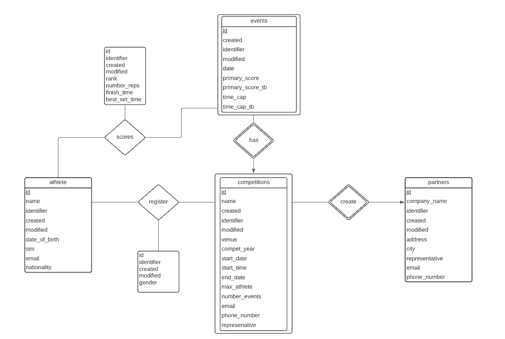
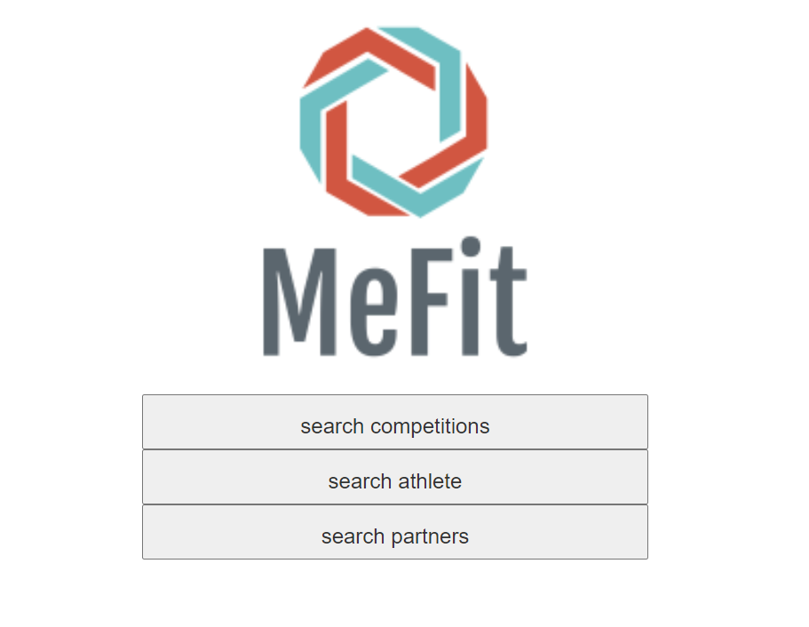
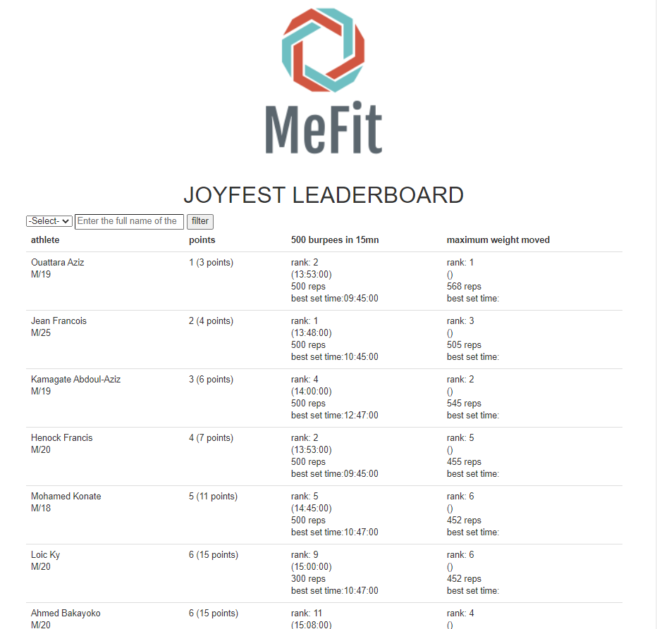
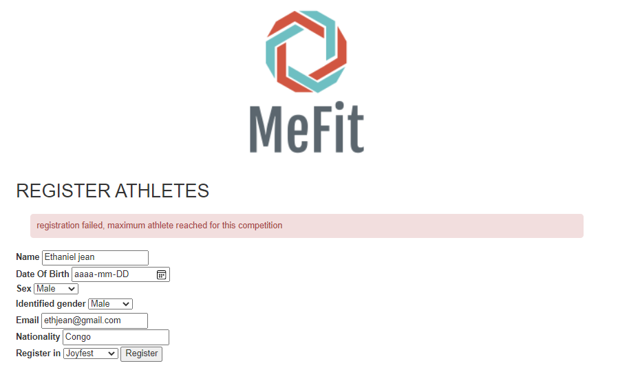

# Projet Universitaire CSI2532


| Nom              | Numéro d'étudiant | Email               |
| ---------------- | ----------------- | ------------------- |
| Mohamed Konate   | 300136750         | mkona055@uottawa.ca |
| Wilfried Sankara | 300100940         | wsank045@uottawa.ca |

## Livrables précédents

- [Livrable1](livrable1.md)
- [Livrable2](livrable2.md)


## Livrable 3


| Mark | Description                                                  | Comment                                                      |
| ---- | ------------------------------------------------------------ | ------------------------------------------------------------ |
| 2.0  | Modèle ER                                                    | Voir ci-dessous                                              |
| 2.0  | Modèle relationnel / schéma SQL                              | Voir ci-dessous le modèle relationnel,Voir le [schema](db/schema.sql) |
| 2.0  | Application                                                  | Voir ci -dessous                                             |
| 2.0  | SQL "seed" /SQL examples/migrations                          | Voir le "[seed](db/seed.sql)"  ,voir les "[migrations](db/migrations)"et voir  ci-dessous les exemples |
| 1.0  | README.md contient toutes les informations requises          | Voir cette page                                              |
| 1.0  | Utilisation de git (messages de commit, tous les étudiants impliqués) | Voir [les details des commits dans GitHub](https://github.com/professor-forward/projet-team-awesome/commits/main) |
| / 10 |                                                              |                                                              |

### Description de l'application

* Le leaderboard doit gérer les athlètes. Un athlète a un nom, un e-mail, une date de naissance et un sexe identifié. Ils ont un identifiant unique au monde. Les athlètes peuvent inclure n'importe quel nombre d'attributs
  supplémentaires, par exemple la nationalité de l'athlète.
* Pour chaque partenaire, nous devons connaître le nom de son entreprise, leur adresse, une personne de
  contact, y compris leur e-mail et numéro de téléphone.
* Les compétitions (il peut y en avoir plusieurs) de chaque partenaire appartient à une année de compétition
  particulière, qui peut être différente de l'année civile. Pour chaque compétitions, nous avons la date du
  compétitions (elle peut s'étendre plusieurs jours), le nombre maximum d'athlètes (en fonction du sexe identifié),
  le nombre d'événements, l'adresse de la compétition et une personne de contact (y compris un e-mail et un
  numéro de téléphone). Notez que certains événements n'ont pas de maximum permettant à autant de
  personnes que possible de se joindre.
* Pour chaque événement d'une compétition, nous devons savoir comment il est marqué. Les deux principales
  façons de marquer un événement sont basées sur le temps (le plus vite sera le mieux), sur le nombre de
  répétitions (le plus sera le mieux), ou le poids déplacé (également le plus sera le mieux).
* Mais, tous les événements ne peuvent pas être terminés à temps et nécessitent des bris d'égalité. Les bris
  d'égalité sont marqués de la même manière que l'événement peut être marqué. Le bris d'égalité peut être basé
  sur le temps (le plus vite sera le mieux), sur le nombre de répétitions (le plus sera le mieux), ou sur le poids
  déplacé (également le plus sera le mieux). Tous les événements n'ont pas de bris d'égalité.
* S'il y a encore égalité après cela, les athlètes sont à égalité et chacun obtient le même rang pour cette
  événement. Le score global d'un athlète dans une compétition est la somme de chaque événement, et cette
  fois plus le nombre est bas, mieux c'est.
* Le leaderboard d'une compétition montre le position de chaque athlète sur chaque événement et leur position
  général de la compétition. Des leaderboards personnalisés peuvent être créés en filtrant les athlètes en
  fonction d'un ou plusieurs de leurs attributs. Par exemple, un leaderboard basé sur le sexe; ou une autre basée
  sur la nationalité ET le sexe.
* Les administrateurs MeFit peuvent ajouter de nouvelles entreprises en tant que partenaires autorisés à
  organiser des compétitions. À l'aide d'un jeton sécurisé, les partenaires peuvent inscrire des athlètes à une
  compétition via une API / application en ligne.
  Les utilisateurs peuvent rechercher les partenaires, les compétitions et les leaderboards. Un leaderboard peut
  être recherché pour les athlètes.
  Nous devrions pouvoir supprimer de notre base de données les partenaires, compétitions et événements.
  Nous ne pouvons pas avoir dans la base de données des informations sur un événement sans avoir les
  informations sur le compétitions correspondant. De la même manière, nous ne pouvons pas avoir dans la base
  de données des informations sur les compétitions sans avoir les informations sur le partenaire correspondant.

### Diagram ER 

Ce diagramme a été réalisé avec [LucidChart](https://lucid.app/)




### Modèle Relationel 

Ce diagramme  a été réalisé aussi avec [LucidChart](https://lucid.app/)


### Schéma SQL  après les migrations

[Cliquez ici pour consulter le fichier]((db/schema.sql))


### Seed SQL/Exemples de requête pour INSERT

* Incluez un "seed" script SQL pour ajouter des exemples de données. Cette "seed" devrait être basé sur votre schéma le plus récent.

  [Cliquez ici pour consulter le fichier]((db/seed.sql))

### Exemples de requête pour UPDATE

On change le nom de l'athlète 'Loic Ky' en 'Loic Ky Bambara'

``` sql
UPDATE athlete SET name = 'Loic Ky Bambara' WHERE name = 'Loic Ky';
```

On remplace l'heure des compétitions qui débutent à 14:00 par 15:00 .

```sql
UPDATE competitions SET start_time = '15:00' WHERE start_time ='14:00';
```

On remplace l'enregistrement de athlète ayant l'id  1 à la compétition 1 par la compétition 2

```sql
UPDATE register SET competition_id = 2 WHERE competition_id = 1 AND athlete_id = 1;
```

On remplace le temps final de l'athlète ayant l'id  1 à 13:00

```sql
UPDATE scores SET finish_time = '13:00' WHERE athlete_id = 1 ;
```

On remplace le nom du représentatif des partenaires ayant le représentatif 'Bertrand  Asher' par 'Bertrand François Asher '

```sql
UPDATE partners SET representative = 'Bertrand François Asher' WHERE representative = 'Bertrand Asher' ;
```

On change le nom des évènements nommés "20.1" par "22.1" 

```sql
UPDATE events SET name = '22.1' WHERE representative = '20.1' 
```

### Exemples de requête pour SELECT

On sélectionne tous les athlètes masculins

```sql 
SELECT * FROM athlete WHERE sex = 'M';
```

On sélectionne en ordre croissant le nom de toutes les compétitions

```sql
SELECT name FROM competitions ORDER BY name ASC; 
```

On sélectionne tous les enregistrements à la compétition 'JoyFest'

```sql
SELECT * FROM register JOIN  competitions ON competitions.id = register.competition_id WHERE competitions.name = 'JoyFest';
```

On sélectionne le nom de  tous les événements de  la compétition 'JoyFest'

```sql
SELECT name FROM events JOIN competitions ON competitions.id = events.competition_id WHERE competitions.name = 'JoyFest';
```

On sélectionne le nom de  tous les compétitions du partenaire 'Plateau Inc.'

```sql
SELECT name FROM partners JOIN competitions ON competitions.partner_id = partners.id WHERE partners.company_name = 'Plateau Inc.';
```

On sélectionne les scores de 'Mohamed Konate' et les id des évènements associés.

```sql
SELECT event_id,number_reps,finish_time,best_set_time FROM scores JOIN athlete ON athlete.id = athlete_id WHERE athlete.name  = 'Mohamed Konate';
```


### Exemples de requête pour DELETE

On supprime tous les enregistrements à la compétition 'Ottawa Fest' 

```sql
DELETE FROM register WHERE competition_id = 3;
```

On supprime la compétition 'JoyFest'

```sql
DELETE FROM competitions WHERE competition_id = 1;
```

On supprime athlète 'Molly Kanyatsi'

```sql
DELETE FROM athlete WHERE name = 'Molly Kanyatsi';
```

On supprime l'évènement '20.1'

```sql
DELETE FROM events WHERE name = '20.1';
```

On supprime le partenaire 'Plateau Inc.'

```sql
DELETE FROM partners WHERE name = 'Plateau Inc.';
```

On supprime les scores de athlète Mohamed Konate ayant le id 1

```sql
DELETE FROM scores WHERE athlete_id = 1;
```


### Script de  Migration

Veuillez regarder les migrations que vous n'avez pas effectuées depuis le livrable 2 puis effectuer les.

Ces [migrations](db/migrations) ont été exécutées avec postgres

### Application

Notre application utilises PHP. Veillez à ce que votre environnement de travail soit adapté à la connexion à partir d'une base de données PostgreSQL. 

Créer une base de données PostgreSQL à partir du Command Line(CMD) s'assurer que le CMD pour chemin celui du *repository* duquel ce fichier README.md est extrait

```shell
psql -c "CREATE DATABASE leaderboard "
```

Ajouter le schéma et le *seed* à notre base de données

``` shell
psql -d leaderboard -f db/schema.sql -f db/seed.sql
```

Ouvrez le fichier [config.php](public/config.php) puis rajouter vos identifiants de connexion PostgreSQL à la ligne 2

*Si votre port par défaut n'est pas pas égal à 5432 le modifier en conséquence.*

```php
$db = pg_connect("host = localhost port=5432 dbname=leaderboard user=your_username password=your_password");
```

Ensuite, lancez le cmd à partir du dossier public qui est contenu également dans ce livrable. et entrez la commande ci dessous

```shell
php -S localhost:4000
```

Puis ouvrez une page web et entrer en tant que URL ***localhost:4000*** 

### Pages Web pour utilisateurs

Vous devrez voir ceci :



Cette page est destinée aux utilisateurs communs tous le monde peut y avoir accès. Les utilisateurs peuvent rechercher des compétitions et des partenaires .


Afin d'avoir accès au leaderboard un clic sur le nom de la compétitions devrait faire l'affaire. Ici on clic sur JoyFest





Vous avez des pages web similaires pour les partenaires et les athlètes.


### API et application pour les partenaires

Les partenaires doivent avoir leur propre jeton et on le vérifie de la sorte :

```bash
yourpathto\public>curl -i -H "partner-api-key:d40db17785bfc3057d2995bd7aab1514" http://localhost:4000/api.php
HTTP/1.1 200 OK
Host: localhost:4000
Date: Wed, 31 Mar 2021 05:05:06 GMT
Connection: close
X-Powered-By: PHP/8.0.2
Content-Type: application/json
URL_TO_COPY:http://localhost:4000/partners_space.php?identifier=d40db17785bfc3057d2995bd7aab1514

{"Success":"Connected Successfully. Copy and paste the above URL into your browser "}
```

ici le jeton généré automatiquement pour le partenaire Plateau Inc. est d40db17785bfc3057d2995bd7aab1514

Afin de trouver le jeton correspondant dans votre base de données en tant qu'administrateur MeFit vous pouvez faire:

```sql
SELECT identifier from partners WHERE comapany_name = 'Plateau Inc.';
```

Si le jeton est incorrect on aura ceci:

```bash
yourpathto\public>curl -i -H "partner-api-key:itsnotgoingtowork55555" http://localhost:4000/api.php
HTTP/1.1 401 Unauthorized
Host: localhost:4000
Date: Wed, 31 Mar 2021 06:27:04 GMT
Connection: close
X-Powered-By: PHP/8.0.2
Content-Type: application/json

{"Authentication error":"Please provide a valid secret-key"}
```

 Dans le cas ou le jeton est correct le partenaire a accès a un UI qui lui est propre grâce a une URL qui lui est fournie comme vous pouvez le voir ci haut.

En copiant cette URL on obtient ceci:


Ici le partenaire peut créer des compétitions:


Ou inscrire des athlètes  :


si le nombre maximum est atteint vous aurez un message d'erreur vous le mentionnant ici on inscrit un nouvel athlete masculin a Joyfest qui a déja 10 athletes masculins(max):




En cliquant sur les compétitions qui sont dans la colonne "registered in"  le partenaire peut entrer les scores correspondant à l'évènement choisi.

Ici on clique sur JoyFest pour 'Mohamed Konate' on update à 701reps pour l'évenement "20.2"


Seuls les administrateurs MeFit peuvent supprimer des compétitions des partenaires, évènements et athlète(Voir exemple de DELETE ci haut). Si les partenaires veulent faire des suppressions de leurs compétitions, évènements ou annuler une inscription a une compétition ils devront contacter MeFit.

Dans le prochain livrable nous ajouterons ces mécanismes afin de permettre aux partenaires de réaliser ces suppressions.